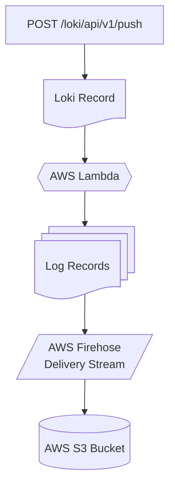

# Stytch Event Logs Loki Ingestion Lambda

This project provides a Loki Ingestion endpoint for Stytch Event Logs on AWS.



## Lambda Function: Batch Record Processing

The Lambda function is designed to process a batch of event log records in a single invocation. Each HTTP POST request from the client can contain multiple event logs, which are ingested as a batch. The Lambda function parses the batch, transforms each record as needed, and forwards the processed records to the AWS Firehose Delivery Stream for further handling and storage.

## Prerequisites (Development)

1. Node.js 22.x (nvm support included)
2. Docker and Localstack
3. awslocal wrapper
4. cdklocal wrapper

Setting up the development environment:

```sh
$ npm i
$ npm run build
```

Setting up cloud resources in Localstack:

```sh
$ cdklocal bootstrap
$ cdklocal deploy "Dev/*"
```

Updating the Lambda function in Localstack:

```sh
$ npm run build
$ cdklocal deploy "Dev/*"
```

### Testing

Unit tests:

```sh
$ npm run test
```

Local integration tests:

```sh
$ npm run test:integration
```

Code coverage:

```sh
$ npm run test:coverage
```

### Testing the Lambda via Localstack

Get the lambda URL:
```sh
$ awslocal lambda get-function-url-config \
  --function-name $(awslocal lambda list-functions --output text --query 'Functions[*].FunctionName') \
  --output text --query 'FunctionUrl'
```

Invoke the health endpoint to make sure its running:

```sh
$ curl http://<lambda-url-here>.lambda-url.us-east-1.localhost.localstack.cloud:4566/healthz
{"status":"healthy"}
```

Pull the secret from secret manager.

```sh
$ awslocal secretsmanager get-secret-value \
  --secret-id $(awslocal secretsmanager list-secrets --output text --query 'SecretList[*].Name') \
  --output text --query 'SecretString'
{ "username": "stytch-logs-ingestion", "password": "1234" }
```

Execute a POST request using the credentials:

```sh
$ curl -X POST \
  http://stytch-logs-ingestion:1234@<lambda-url>.lambda-url.us-east-1.localhost.localstack.cloud:4566/loki/api/v1/push \
   -H "Content-Type: application/json" \
   -d '{"streams":[{"stream":{"label":"value"},"values":[["1748893746595000000","<log line 0>"]]}]}'
{"status":"success","count":1}
```

Check that the record was ingested:

```sh
$ awslocal s3api list-objects \
    --bucket $(awslocal s3api list-buckets --prefix dev-lokilogingestion-firehosetos3s3bucket --output text --query 'Buckets[*].Name')
{
    "Contents": [
        {
            "Key": "2025/06/03/14/stytch-log-ingestion-2025-06-03-14-07-49-4a9d1308-e5dc-47ae-b912-36fb5cde4cd0",
            "LastModified": "2025-06-03T14:07:49+00:00",
            "ETag": "\"54645dee8e9e77f7cc740b011a66f5e4\"",
            "ChecksumAlgorithm": [
                "CRC32"
            ],
            "ChecksumType": "FULL_OBJECT",
            "Size": 290,
            "StorageClass": "STANDARD",
            "Owner": {
                "DisplayName": "webfile",
                "ID": "75aa57f09aa0c8caeab4f8c24e99d10f8e7faeebf76c078efc7c6caea54ba06a"
            }
        },
    ],
    "RequestCharged": null,
    "Prefix": ""
}
```

### Linting / Styling

eslint:

```sh
$ npm run lint
```

prettier:

```sh
$ npm run format:check
$ npm run format
```
